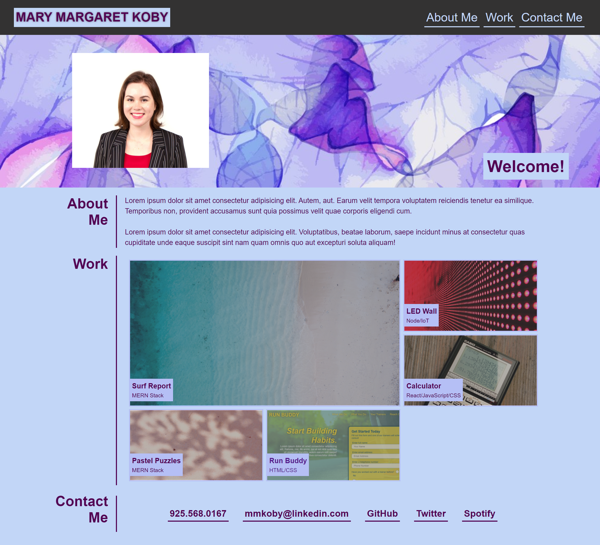

# Portfolio
Professional portfolio website with a link to the deployed website Run Buddy and placeholder images for future projects.

## Files and Directories
There is a gitignore file. The CSS file and images live in the assets folder.

## Publishing
The website is published using github pages.

## Link to application
[Click here to visit the portfolio](https://mymy-4242.github.io/portfolio-challenge2/)
